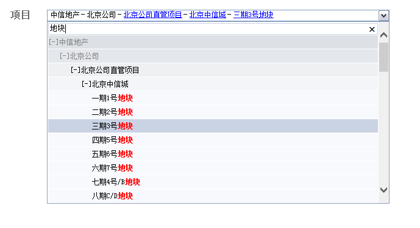
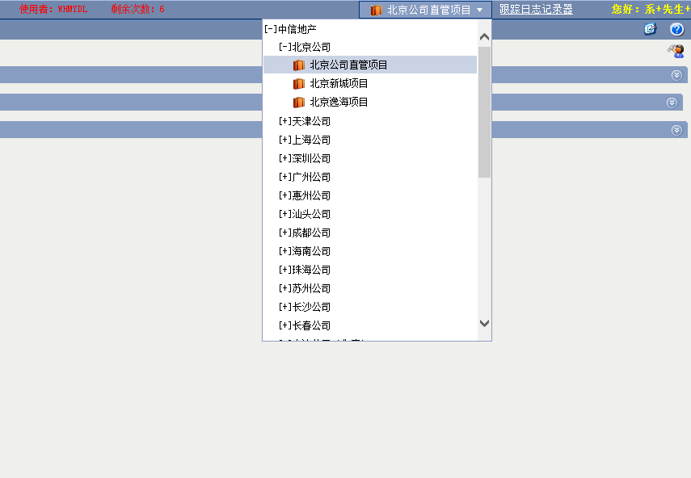

+ [DDTree](ddtree.md)

+ [selector](selector/)

## DDTree


DDTree是一个通用的选择公司，部门，项目控件

**由于平台只提供末级公司有过滤权限的末级项目，如要使用集团级或者区域公司的末级项目，
需要改造存储过程，存储过程的文件路径/project/ddtree/usp_myProjFilterBase.sql**

##Quick start

+ 在页面上使用位置添加div和js引用

```html
<div id="ddtree"></div>
<script type="text/javascript" src="/project/js/sea.js"></script>
```

+ 在页面底部添加调用

```javascript  

    var TreeType = { None: -1, Group: 0, Company: 10, EndCompany: 20, Dept: 30, Project: 60, EndProject: 70 }    
    var option = {
              onchange: false  //选择元素后的回调函数
             , treeType: TreeType.EndProject //数据加载类型
             , selectType: TreeType.EndCompany //可以选择的类型
             , showType: TreeType.EndProject //默认展开类型，-1不展开            
              , applySys: '0201' //业务系统
    }
    option.onchange = function(item) {
      //ddtree._selItem //当前选择的值
     //   alert(item.type + "----" + item.id + "-----" + item.name);

}
var ddtree=null;
seajs.use('DDTree', function(DDTree) {
    ddtree = new ddtree('ddtree', option);

});

```



options
====

```javascript
var TreeType = { None: -1, Group: 0, Company: 10, EndCompany: 20, Dept: 30, Project: 60, EndProject: 70 }  

```

 名称            |类型           | 说明                       | 默认值        
 :--------------| :------------ | :------------------------- |:-----------  
 showSearch     |  bool         | 是否显示搜索框  | true
 onchange       |  function     | 选择元素后的回调函数  | false
 treeType     |  int     | 控件数据加载类型  | TreeType.EndProject
 selectType     |  int    | 控件可选择的节点类型  | TreeType.EndProject
 showType     |  int   | 默认展开类型，-1不展开  | TreeType.EndProject
 showGroup     |   bool       | 是否显示集团  | true
 showCompany     |  bool         | 是否显示区域公司  | true
 applySys     |  string         | 业务系统，在控件类型为项目是有效  | '0201'
 serviceMethod     |  string         | 后台数据提供方法  | 'MySoft.Project.Control.DDTreeService.GetDDTreeData'
 autoSwitchCompany |bool | 是否自动切换公司 | false


method&properties
=====

| 名称     | 类型     | 说明
| :------------- | :------------- |
| \_selItem | property | 当前控件选择的item
| setValue | method | 设置控件的值，传入code或者id


## CompanyMenuTree
CompanyMenuTree 继承于ddtree，与其具有相同接口
##Quick start
在menu.aspx页面底部添加
```html
<script type="text/javascript" src="/project/js/sea.js"></script>   

<script language="javascript" type="text/javascript">
seajs.use('DDTree/CompanyMenuTree', function(ctree) {
    var d = new ctree();
});


```

