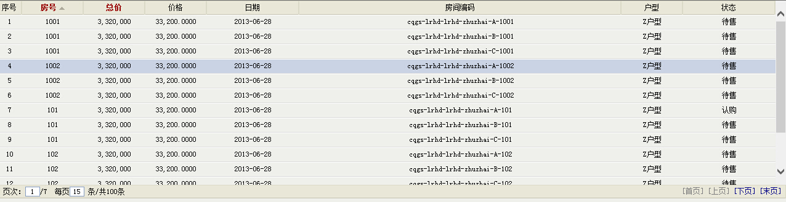

+ [control](../README.md)


## myRepeater


myRepeater 是在原来MAP平台下面的repeater进行优化改造，提升易用性、兼容性

##Quick start

+ 在页面上使用位置添加js引用

```html
<link rel="stylesheet" type="text/css" href="/_common/styles/global.css" />
<link rel="stylesheet" type="text/css" href="/_grid/map_grid.css" />
<link rel="stylesheet" type="text/css" href="/_forms/styles/form.css" />
<script type="text/javascript" src="/Project/js/sea.js"></script>

<script type="text/javascript">
seajs.use('myRepeater', function(myrepeater) {

 var options = {
     columns: [
                 {   title: "房号",
                     field: "Room",
                     width: "100",
                     req: true,
                     editor: { type: "textbox", option: { onchange: function() { }, maxlength: 3, min: -99999, max: 999999999} }
                 },
                 { title: "总价",
                     field: "Total",
                     width: "100",
                     editor: { type: "numbox", option: { onchange: function() { }, maxlength: 3, min: -99999, max: 999999999, ro: 0} },
                     datatype: "number",
                     format: "#,###",
                     req: true
                 },
                  { title: "日期",
                    field: "SLControlDate",
                    width: "150",
                    datatype: "datetime",
                    format: "yyyy-MM-dd",
                    editor: { type: "datetimebox", option: { time: 0, maxlength: 10, change: function() { } } }
                  },
                 { title: "房间编码"
                 , field: "RoomCode"
                 , width: ""

                 },
                 { title: "户型"
                 , field: "HuXing"
                 , width: "100"
                     , editor: { type: "combobox", option: { data: [{ value: 1, text: "x1" }, { value: 2, text: "x2"}]} }
                 },
                 { title: "状态"
                 , field: "Status"
                 , width: "150"
                     , editor: { type: "lookupbox", option: { onclick: function() { alert(this.tagName); } } }
                 }
              ]
     , idField: "RoomGUID"
     , serviceMethod: "Mysoft.Project.Control.myRepeaterService.GetRepeaterDemoData"
     , sortField: "Room asc"
     , mutiSelect: false
     , height: "300px"
     , pagesize: 15
 };
 rep = new myrepeater('repTest', options);
</script>
```
## 效果展示
+单选列表

+多选编辑

## 属性

| 名称 | 类型 | 说明 |默认值|
| :------------- | :------------- | :------------- | :------------- |
| columns       | Array       |显示列的配置信息，是列配置对象的集合|[]|
| idField       | String       |数据源的标识列，即主键|空字符串|
| enablePager       | Boolean       |是否启用分页|true|
| mutiSelect       | Boolean       |是否多选|false|
| pageindex       | int       |页码|1|
| pagesize       | int       |每页显示条数|20|
| queryParams       | json/function       |自助查询的参数|｛｝|
| serviceMethod       | String     |后台取数调用的方法，格式为：命名空间+类名+方法名；参数传递使用queryParams|null|
| sortField       | String     |用于排序的字符串如：Room asc,RoomCode desc|空字符串|
| height       | String/int      |控件显示高度|300px|
| deleterows       | Array       |获取删除的数据|[]|
| editors       | json       |内置控件集合|内置控件集合|

## column属性
| 名称 | 类型 | 说明 |默认值|
| :------------- | :------------- | :------------- | :------------- |
| title       | String       |列标题|空字符串|
| field       | String       |数据取值字段|空字符串|
| width       | String       |列宽|空字符串|
| align       | String       |对齐方式|空字符串|
| datatype       | String       |目前支持number和datetime|空字符串|
| format       | String       |格式化字符串支持日期和数据的格式化|空字符串|
| req       | Boolean       |设置是否必填|false|
## editor
| 名称 | 类型 | 说明 |默认值|
| :------------- | :------------- | :------------- | :------------- |
| type       | String       |控件类型目前支持：numbox,textbox,datetimebox,lookupbox,combobox|空字符串|
| option       | json       |支持对应控件类型属性配置，属性基本为ERP原生控件可设置的属性如{ onchange: function() { }, maxlength: 3, min: -99999, max: 999999999, ro: 0}|空字符串|
+ 方法

| 名称 | 参数 | 说明 |
| :------------- | :------------- | :------------- |
| init       | target, col       |加载控件|
| setValue       | target, value       |给控件设置值|
| getValue       | target       |获取控件的值|
| destroy       | target, col       |销毁控件|
## 方法

| 名称 | 参数 | 说明 |
| :------------- | :------------- | :------------- |
| init       |        |加载控件|
| setData       | data       |设置控件数据，加载控件UI|
| SetRowEdit       | row, data       |设置列编辑显示|
| loadData       |       |获取后台返回数据|
| reload       |    param   |重新加载列表数据|
| getData       |       |获取当前列表数据|
| getRowIndex       |   row    |获取指定行的索引|
| getSelected       |       |获取选中的数据|
| selectRow       |   index    |获取指定索引的行|
| enableEdit       |       |启用列表编辑|
| disableEdit       |       |禁用编辑|
| newRow       |    item   |新增行，传入行配置数据|
| deleteRow       |  arrSelected     |删除选中的行|
| showColumn       |    field   |显示指定的列|
| hideColumn       |    field   |隐藏指定列|
| getRowFieldValue       |   row， field   |获取指定行字段数据|
| validData       |     |启用编辑时，验证数据必填|

## 事件

| 名称 | 参数 | 说明 |
| :------------- | :------------- | :------------- |
| onClickRow       |   index,row  |行单击事件|
| onDblClickRow       |   index,row  |行双击事件|
