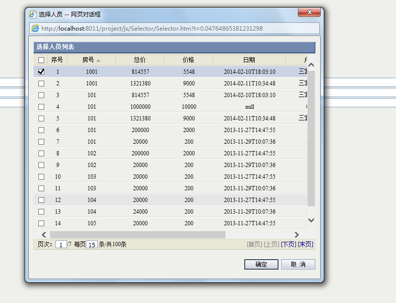

+ [DDTree](../ddtree.md)


## selector


selector是一个通用的弹出选择控件，不需要新增页面
selector是采用新的Repeater打造的

##Quick start

+ 在页面上使用位置添加js引用

```html
<script type="text/javascript" src="/project/js/sea.js"></script>

<script type="text/javascript">
    var options = {
    //显示的列
        columns: [
        { title: "房号", field: "Room", width: "100" },
        { title: "总价", field: "Total", width: "100" },
        { title: "价格", field: "Price", width: "100" },
        { title: "日期", field: "SLControlDate", width: "150" },
        { title: "房间编码", field: "RoomCode" },
        { title: "户型", field: "HuXing", width: "100" },
        { title: "状态", field: "Status", width: "150" }
    ],
        //绑定控件，当返回时自动填充值
        bindCtrls: [
    { field: "Room", control: 'txtid' },
    { field: "RoomCode", control: 'txtRoomCode' },
    { field: "HuXing", control: 'txtHuXing' }
    ],
        serviceMethod: "Mysoft.Project.Control.myRepeaterService.GetRepeaterDemoData" //后台数据提供方法
    , sortField: "Room asc"//默认排序
    , mutiSelect: true //是否多选
    , height: 500
    , pagesize: 15, //分页大小
        title: '选择人员'
    };

    function openSel() {
        seajs.use('Selector', function(Selector) {
            var retValue = Selector.open(options);
        });
    }
</script>
```



