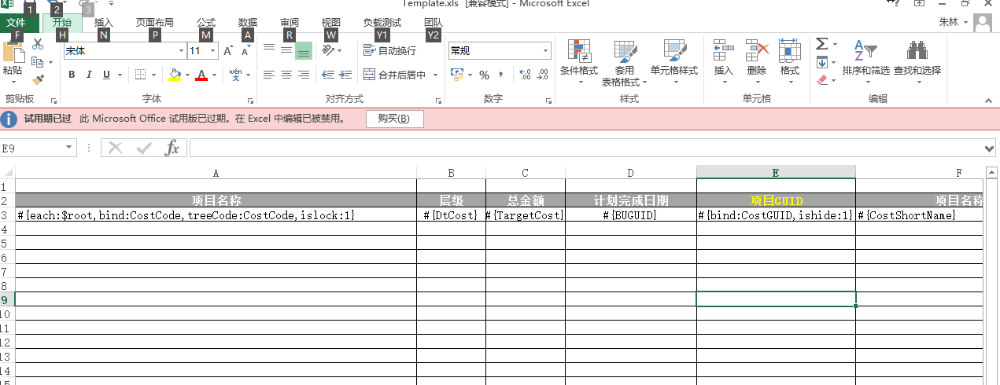

+ [Excel](Excel.md)

在Excel导入导出中将会生成excel的元数据，并隐藏在生成的的excel文档中
，可以通过Datatable或者实体集合来导出导入

模版支持语法，
模版规则：

1. 模版绑定都包裹在#{}中

2. 支持列表绑定，在需要循环的列开头模版中添加 each:数据源，
数据源是可遍历的数据集合，如datatable，list等
数据源=$root 代表是根元素


3. 绑定字段直接使用#{字段名}即可，也可以使用模版的完整语法#{value:字段名}

## 模版语法：


| 名称     | 说明     |
| :------------- | :------------- |
| each |  绑定表格  |
| value |  设置单元格绑定的字段   |
| treeCode |  设置树型code绑定字段，在each节点中有效  |




##Quick start

+ 导出用法
```C#  
public string TestExportDatatable(string fileTemplate)
			 {

					 var data = DBHelper.GetDataTable(@"select top 300 RoomGUID,Room,RoomCode,HuXing,Total,Price,Status,SLControlDate
from p_Room where SLControlDate is not null  order by  Roomcode asc");
					 var str = ExcelHelper.ExportExcel(fileTemplate, data);
					 return str;
			 }
			 public string TestExportList(string fileTemplate)
			 {

					 var data = DBHelper.GetList < p_Room>(@"select top 300 RoomGUID,Room,RoomCode,HuXing,Total,Price,Status,SLControlDate
from p_Room where SLControlDate is not null  order by  Roomcode asc");
					 var str = ExcelHelper.ExportExcel(fileTemplate, data);
					 return str;
			 }
```
+ 无须模版，自定义列导出
```C#
public string TestExportDymic(string filePath)
			 {
					 var data = DBHelper.GetList<p_Room>(@"select top 300 RoomGUID,Room,RoomCode,HuXing,Total,Price,Status,SLControlDate
from p_Room where SLControlDate is not null  order by  Roomcode asc");
					 var cols = new List<ExcelColumn>()
					 {
							 new ExcelColumn{ Filed="RoomGUID", Name="房间GUID", Width=100}
							 , new ExcelColumn{ Filed="Room", Name="房间", Width=200}
							,  new ExcelColumn{ Filed="RoomCode", Name="房间编码", Width=150}
							,   new ExcelColumn{ Filed="HuXing", Name="户型", Width=200}
							,    new ExcelColumn{ Filed="Total", Name="总价", Width=100}
							,    new ExcelColumn{ Filed="Price", Name="价格", Width=100}
							,    new ExcelColumn{ Filed="Status", Name="状态", Width=120}
							,    new ExcelColumn{ Filed="SLControlDate", Name="结束日期", Width=100}
					 };

					 return ExcelHelper.ExportExcel(cols,data);

			 }
```

+ 导入

```C#
public DataTable TestImportDatatable(string filePath)
			 {

					 return ExcelHelper.Import<DataTable>(filePath);

			 }
			 public List<p_Room> TestImportList(string filePath)
			 {
					 return ExcelHelper.Import<List<p_Room>>(filePath);

			 }

			 ```
